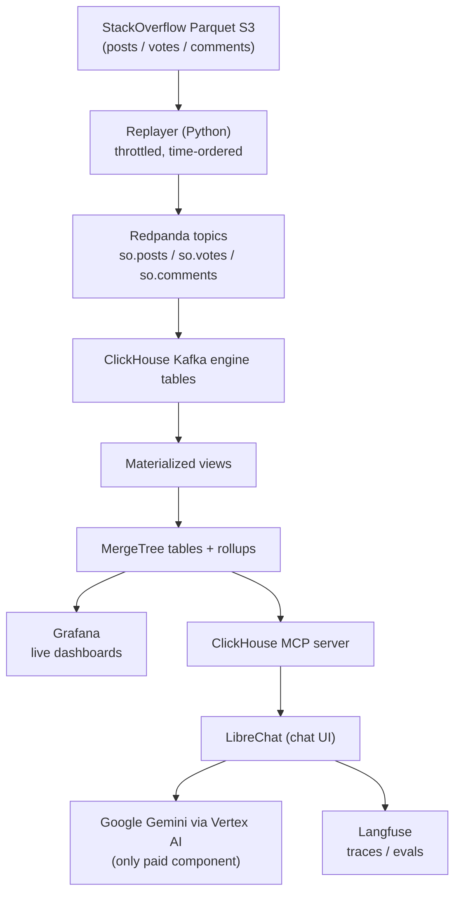

# ClickHouse-Analytics-Agent

A fully local, real-time analytics platform on the ClickHouse StackOverflow dataset, plus a natural-language agent that answers questions by querying ClickHouse through MCP. A Python replayer streams StackOverflow posts/votes/comments onto Redpanda in historical order; ClickHouse consumes them natively (Kafka engine tables + materialized views, no Flink/GlassFlow) into MergeTree tables and live rollups; Grafana dashboards update every 5 seconds; and a LibreChat + ClickHouse MCP + Langfuse agent stack lets you ask plain-English questions answered with real SQL, traced end to end — all free and self-hosted except Google Gemini via Vertex AI, the one metered component.

## Architecture



## Tech stack

| Layer | Tool | License / cost |
|---|---|---|
| Event buffer | Redpanda (Community Edition) | Free / OSS |
| Ingestion into DB | ClickHouse Kafka table engine + materialized views | Free / OSS |
| Storage + compute | ClickHouse (self-hosted) | Free / OSS (Apache 2.0) |
| Dashboards | Grafana + official ClickHouse datasource plugin | Free / OSS |
| Agent chat UI | LibreChat | Free / OSS |
| DB access for agent | ClickHouse MCP server | Free / OSS |
| LLM observability | Langfuse (self-hosted) | Free / OSS |
| LLM | Google Gemini via Vertex AI | Metered / paid |
| Data replay | Python (confluent-kafka, pyarrow, pandas) | Free / OSS |
| Orchestration | Docker Compose + Makefile | Free / OSS |

**Only Gemini costs money.** Every other component is open-source and runs entirely on your machine.

## Quick start

**Prerequisites:**
- Docker + `docker-compose`
- A Google Cloud project with the Vertex AI API enabled, and a service-account key **you treat as already rotated** (never commit it, never share it)

```bash
git clone https://github.com/dineth88/ClickHouse-Analytics-Agent.git
cd ClickHouse-Analytics-Agent

cp .env.example .env
make env    # fills in random secrets for local-only services

# then edit .env by hand:
#   GOOGLE_CLOUD_PROJECT=<your GCP project id>
#   GOOGLE_APPLICATION_CREDENTIALS_HOST_PATH=<absolute path to your rotated service-account JSON>

make up     # brings up the whole stack, builds the ingestion image, waits for health
```

**Service URLs:**

| Service | URL |
|---|---|
| ClickHouse (HTTP) | http://localhost:8123 |
| Redpanda Console | http://localhost:8090 |
| Grafana | http://localhost:3000 |
| LibreChat | http://localhost:3080 |
| Langfuse | http://localhost:3002 |
| LibreChat Admin Panel | http://localhost:3081 |


## Docs

- [`docs/LEARNING.md`](docs/LEARNING.md) — what every component is and why, phase by phase
- [`docs/RUNBOOK.md`](docs/RUNBOOK.md) — step-by-step operating instructions for every phase
- [`docs/SAMPLE_QUESTIONS.md`](docs/SAMPLE_QUESTIONS.md) — natural-language questions to ask the agent, with reference SQL

## Security

- Never commit `credentials.json`, `.env`, or `auth.json` — `.gitignore` excludes them and `make check-secrets` scans staged changes before every push.
- This repo may be public: anyone can read it. If a real secret is ever exposed, rotate it immediately — don't rely on removing it from a later commit, since it remains in git history.
